```mermaid
%%{init: {  'flowchart': {    'curve': 'linear',    'rankSpacing': 220,    'nodeSpacing': 120  }}}%%
flowchart LR
classDef entry fill:#c62828,stroke:#ef9a9a,color:#fff;
classDef battle   fill:#2e7d32,stroke:#a5d6a7,color:#fff;
classDef incident  fill:#1565c0,stroke:#90caf9,color:#fff;
classDef transaction   fill:#6a1b9a,stroke:#ce93d8,color:#fff;
classDef exit   fill:#000000,stroke:#ff5252,color:#fff;
classDef default fill:#424242,stroke:#9e9e9e,color:#fff;

    subgraph Layer_0["L0"]
        L0_N0["L0\nScheduleEntryNode"]:::entry
    end

    subgraph Layer_1["L1"]
        L1_N1["L1\nBattleNode"]:::battle
        L1_N2["L1\nIncidentNode"]:::incident
        L1_N3["L1\nBattleNode"]:::battle
    end

    subgraph Layer_2["L2"]
        L2_N4["L2\nTransactionNode"]:::transaction
        L2_N5["L2\nBattleNode"]:::battle
        L2_N6["L2\nBattleNode"]:::battle
        L2_N7["L2\nBattleNode"]:::battle
    end

    subgraph Layer_3["L3"]
        L3_N8["L3\nBattleNode"]:::battle
        L3_N9["L3\nIncidentNode"]:::incident
        L3_N10["L3\nBattleNode"]:::battle
    end

    subgraph Layer_4["L4"]
        L4_N11["L4\nIncidentNode"]:::incident
        L4_N12["L4\nTransactionNode"]:::transaction
        L4_N13["L4\nBattleNode"]:::battle
        L4_N14["L4\nBattleNode"]:::battle
    end

    subgraph Layer_5["L5"]
        L5_N15["L5\nBattleNode"]:::battle
        L5_N16["L5\nIncidentNode"]:::incident
        L5_N17["L5\nTransactionNode"]:::transaction
        L5_N18["L5\nBattleNode"]:::battle
    end

    subgraph Layer_6["L6"]
        L6_N19["L6\nIncidentNode"]:::incident
        L6_N20["L6\nBattleNode"]:::battle
        L6_N21["L6\nIncidentNode"]:::incident
        L6_N22["L6\nTransactionNode"]:::transaction
    end

    subgraph Layer_7["L7"]
        L7_N23["L7\nBattleNode"]:::battle
        L7_N24["L7\nTransactionNode"]:::transaction
        L7_N25["L7\nBattleNode"]:::battle
    end

    subgraph Layer_8["L8"]
        L8_N26["L8\nIncidentNode"]:::incident
        L8_N27["L8\nTransactionNode"]:::transaction
        L8_N28["L8\nBattleNode"]:::battle
        L8_N29["L8\nBattleNode"]:::battle
    end

    subgraph Layer_9["L9"]
        L9_N30["L9\nBattleNode"]:::battle
        L9_N31["L9\nIncidentNode"]:::incident
        L9_N32["L9\nTransactionNode"]:::transaction
        L9_N33["L9\nIncidentNode"]:::incident
    end

    subgraph Layer_10["L10"]
        L10_N34["L10\nScheduleExitNode"]:::exit
    end

    L0_N0 --> L1_N1
    L0_N0 --> L1_N2
    L0_N0 --> L1_N3
    L1_N1 --> L2_N4
    L1_N1 --> L2_N7
    L1_N2 --> L2_N4
    L1_N2 --> L2_N5
    L1_N3 --> L2_N6
    L2_N4 --> L3_N8
    L2_N4 --> L3_N10
    L2_N5 --> L3_N9
    L2_N6 --> L3_N8
    L2_N6 --> L3_N9
    L2_N7 --> L3_N9
    L3_N8 --> L4_N11
    L3_N9 --> L4_N13
    L3_N10 --> L4_N12
    L3_N10 --> L4_N14
    L4_N11 --> L5_N18
    L4_N12 --> L5_N16
    L4_N12 --> L5_N17
    L4_N13 --> L5_N16
    L4_N13 --> L5_N17
    L4_N13 --> L5_N18
    L4_N14 --> L5_N15
    L5_N15 --> L6_N19
    L5_N16 --> L6_N20
    L5_N17 --> L6_N20
    L5_N17 --> L6_N22
    L5_N18 --> L6_N21
    L6_N19 --> L7_N25
    L6_N20 --> L7_N23
    L6_N20 --> L7_N24
    L6_N20 --> L7_N25
    L6_N21 --> L7_N23
    L6_N21 --> L7_N25
    L6_N22 --> L7_N23
    L6_N22 --> L7_N24
    L7_N23 --> L8_N28
    L7_N24 --> L8_N26
    L7_N24 --> L8_N29
    L7_N25 --> L8_N27
    L7_N25 --> L8_N29
    L8_N26 --> L9_N31
    L8_N27 --> L9_N31
    L8_N27 --> L9_N32
    L8_N27 --> L9_N33
    L8_N28 --> L9_N30
    L8_N28 --> L9_N31
    L8_N28 --> L9_N32
    L8_N29 --> L9_N31
    L8_N29 --> L9_N33
    L9_N30 --> L10_N34
    L9_N31 --> L10_N34
    L9_N32 --> L10_N34
    L9_N33 --> L10_N34
```

# Schedule Skeleton Generation

- **Seed**: `1112372156`
- **Attempt**: `91`

## Schedule Skeleton Rule
- Layer: 7 ~ 9
- NodePerLayer: 3 ~ 5
- MaxNodeLinkCount: 3
- AdditionalLinkMultiplierChance: 0.5
## Node Type Resolve Rule
- MaxBattleSequence: 4
- MaxIncidentSequence: 1
- MaxTransactionSequence: 0
### Early Layer Zone Rule
- Battle Node Weight : 80
- Incident Node Weight : 20
- Transaction Node Weight : 0
- Min Battle Node Count : 0
- Min Incident Node Count : 0
- Min Transaction Node Count : 0
### Middle Layer Zone Rule
- Battle Node Weight : 50
- Incident Node Weight : 30
- Transaction Node Weight : 20
- Min Battle Node Count : 0
- Min Incident Node Count : 0
- Min Transaction Node Count : 1
### Late Layer Zone Rule
- Battle Node Weight : 40
- Incident Node Weight : 40
- Transaction Node Weight : 20
- Min Battle Node Count : 0
- Min Incident Node Count : 0
- Min Transaction Node Count : 1

