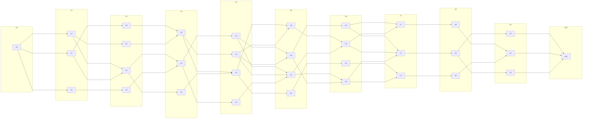

# Schedule Skeleton Generation

- **Seed**: `685396518`
- **Attempt**: `45`

## Rule
- Layer: 7 ~ 9
- NodePerLayer: 3 ~ 5
- MaxNodeLinkCount: 3
- AdditionalLinkMultiplierChance: 0.5

```mermaid
%%{init: {  'flowchart': {    'curve': 'linear',    'rankSpacing': 220,    'nodeSpacing': 120  }}}%%
flowchart LR
    subgraph Layer_0["L0"]
        L0_N0["L0"]
    end

    subgraph Layer_1["L1"]
        L1_N1["L1"]
        L1_N2["L1"]
        L1_N3["L1"]
    end

    subgraph Layer_2["L2"]
        L2_N4["L2"]
        L2_N5["L2"]
        L2_N6["L2"]
        L2_N7["L2"]
    end

    subgraph Layer_3["L3"]
        L3_N8["L3"]
        L3_N9["L3"]
        L3_N10["L3"]
    end

    subgraph Layer_4["L4"]
        L4_N11["L4"]
        L4_N12["L4"]
        L4_N13["L4"]
        L4_N14["L4"]
    end

    subgraph Layer_5["L5"]
        L5_N15["L5"]
        L5_N16["L5"]
        L5_N17["L5"]
        L5_N18["L5"]
    end

    subgraph Layer_6["L6"]
        L6_N19["L6"]
        L6_N20["L6"]
        L6_N21["L6"]
        L6_N22["L6"]
    end

    subgraph Layer_7["L7"]
        L7_N23["L7"]
        L7_N24["L7"]
        L7_N25["L7"]
    end

    subgraph Layer_8["L8"]
        L8_N26["L8"]
        L8_N27["L8"]
        L8_N28["L8"]
    end

    subgraph Layer_9["L9"]
        L9_N29["L9"]
        L9_N30["L9"]
        L9_N31["L9"]
    end

    subgraph Layer_10["L10"]
        L10_N32["L10"]
    end

    L0_N0 --> L1_N1
    L0_N0 --> L1_N2
    L0_N0 --> L1_N3
    L1_N1 --> L2_N5
    L1_N1 --> L2_N6
    L1_N2 --> L2_N4
    L1_N2 --> L2_N5
    L1_N3 --> L2_N7
    L2_N4 --> L3_N8
    L2_N5 --> L3_N9
    L2_N5 --> L3_N10
    L2_N6 --> L3_N8
    L2_N7 --> L3_N9
    L3_N8 --> L4_N13
    L3_N8 --> L4_N12
    L3_N9 --> L4_N11
    L3_N9 --> L4_N14
    L3_N10 --> L4_N12
    L4_N11 --> L5_N18
    L4_N11 --> L5_N16
    L4_N12 --> L5_N15
    L4_N12 --> L5_N17
    L4_N13 --> L5_N16
    L4_N13 --> L5_N15
    L4_N13 --> L5_N18
    L4_N14 --> L5_N16
    L5_N15 --> L6_N20
    L5_N16 --> L6_N22
    L5_N16 --> L6_N20
    L5_N17 --> L6_N21
    L5_N18 --> L6_N19
    L5_N18 --> L6_N22
    L6_N19 --> L7_N23
    L6_N19 --> L7_N25
    L6_N20 --> L7_N23
    L6_N20 --> L7_N25
    L6_N21 --> L7_N24
    L6_N22 --> L7_N24
    L6_N22 --> L7_N23
    L7_N23 --> L8_N26
    L7_N24 --> L8_N28
    L7_N25 --> L8_N27
    L8_N26 --> L9_N29
    L8_N26 --> L9_N31
    L8_N27 --> L9_N30
    L8_N28 --> L9_N30
    L9_N29 --> L10_N32
    L9_N30 --> L10_N32
    L9_N31 --> L10_N32
```
